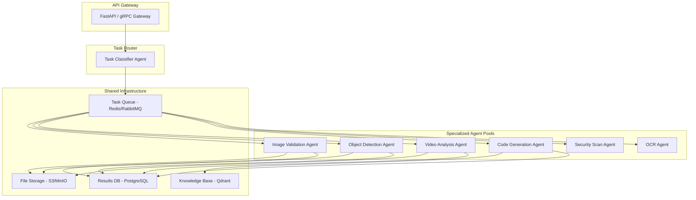

# AgentChanti — Best Use Cases & Multi-Agent BE Service Recommendations

## What AgentChanti Excels At Today

AgentChanti is a **one-shot, multi-agent AI coding CLI** — you give it a task in plain English, and it autonomously Plans → Codes → Reviews → Tests → Delivers. Its superpower is the **pipeline architecture** combined with a **plugin system** that makes it extensible beyond just coding.

---

## 🏆 Best Use Cases for the One-Shot CLI (`agentchanti "..."`)

### Tier 1 — Sweet Spot (What It's Best At)

| Use Case | Why It's a Great Fit |
|---|---|
| **Scaffold entire projects** | `agentchanti "Create a FastAPI app with auth, CRUD, and Docker"` — the Planner breaks it into ordered waves, Coder builds each piece, Tester verifies |
| **Add features to existing code** | KB indexes your project, so it understands your codebase and writes code that fits in |
| **Generate comprehensive tests** | The Tester agent is purpose-built for this; it runs tests and retries on failure |
| **Fix bugs with diagnosis loop** | Give it a bug description → it diagnoses, patches, verifies, auto-retries up to 3× |
| **Code migration / refactoring** | E.g. "Convert all callbacks to async/await" — the Review agent catches regressions |
| **CI/CD one-shot tasks** | `agentchanti "..." --auto --no-git --no-report` — fully headless for automation pipelines |

### Tier 2 — Strong Fit

| Use Case | Why |
|---|---|
| **Documentation generation** | Plan steps to scan code → generate markdown/docstrings → review for accuracy |
| **Boilerplate reduction** | Repetitive patterns (API endpoints, DB models) are perfect for one-shot generation |
| **Prototyping / hackathon sprints** | Go from idea to working prototype in minutes with `--auto` mode |
| **Learning / code examples** | Generate working examples with tests to learn new frameworks |

---

## 🔌 Plugin System — Recommended Plugins to Build

Your plugin system (`StepPlugin` + `PluginRegistry`) is **the key** to unlocking the multi-agent BE service vision. Each plugin registers a new step type that the Planner can include in its pipeline.

### High-Value Plugins

| Plugin Name | Step Type | What It Does |
|---|---|---|
| **`ImageValidationPlugin`** | `[IMAGE_VALIDATE]` | Validates images (format, size, NSFW, corruption) using Pillow + CLIP/BLIP models |
| **`ObjectDetectionPlugin`** | `[DETECT_OBJECTS]` | Runs YOLO/DETR models on images, returns bounding boxes + labels |
| **`VideoAnalysisPlugin`** | `[VIDEO_ANALYZE]` | Frame extraction + per-frame object detection using OpenCV + YOLO |
| **`OCRPlugin`** | `[OCR]` | Extracts text from images using Tesseract or EasyOCR |
| **`LintPlugin`** | `[LINT]` | Runs linters (ruff, eslint, golint) and auto-fixes issues |
| **`DeployPlugin`** | `[DEPLOY]` | Deploys to Docker/K8s/Vercel after successful build + test |
| **`SecurityScanPlugin`** | `[SECURITY]` | Runs Bandit, Trivy, or npm audit for vulnerability scanning |
| **`APITestPlugin`** | `[API_TEST]` | Spins up the server, runs HTTP requests, validates responses |
| **`DatabaseMigratePlugin`** | `[DB_MIGRATE]` | Generates and runs Alembic/Prisma migrations |
| **`PerfTestPlugin`** | `[PERF_TEST]` | Runs load tests with Locust/k6, reports latency metrics |

### Plugin Architecture Pattern

```
agentchanti "Build a REST API that accepts image uploads and detects objects"
```

The Planner would generate:

```
1. [CMD] Install dependencies (fastapi, ultralytics, pillow)
2. [CODE] Create upload endpoint with validation
3. [IMAGE_VALIDATE] Validate sample images (format, size, corruption checks)
4. [DETECT_OBJECTS] Run YOLO on test images, verify bounding box output
5. [CODE] Wire detection results to API response
6. [TEST] Integration tests for the full upload → detect pipeline
7. [DEPLOY] Containerize and deploy
```

---

## 🚀 Multi-Agent BE Service Architecture

Here's a recommended architecture for turning AgentChanti into a **multi-agent backend service**:



### Service Components

#### 1. Image Validation Service
- **Input**: Image file/URL
- **Pipeline**: Format check → Size/resolution check → Corruption detection → NSFW classification → Metadata extraction
- **Models**: Pillow (format), CLIP (content), NudeNet (NSFW)
- **Output**: Validation report (pass/fail, issues, metadata)

#### 2. Object Detection Service
- **Input**: Image file/URL + optional class filter
- **Pipeline**: Preprocessing → Model inference → NMS → Label mapping → Confidence filtering
- **Models**: YOLOv8, DETR, Faster R-CNN (configurable)
- **Output**: Bounding boxes, labels, confidence scores, annotated image

#### 3. Video Analysis Service
- **Input**: Video file/URL + analysis type
- **Pipeline**: Frame extraction → Per-frame detection → Temporal smoothing → Scene segmentation → Summary
- **Models**: YOLOv8 + SORT/DeepSORT (tracking), CLIP (scene)
- **Output**: Timeline of detected objects, scene changes, annotated video

#### 4. Document Intelligence Service
- **Input**: Document image/PDF
- **Pipeline**: Layout detection → OCR → Entity extraction → Classification
- **Models**: Tesseract/EasyOCR + LayoutLMv3 + spaCy NER
- **Output**: Structured data (tables, key-value pairs, entities)

#### 5. Code Quality Service
- **Input**: Repository URL or code snippet
- **Pipeline**: Clone → Static analysis → Security scan → Complexity metrics → Review
- **Tools**: Ruff, Bandit, SonarQube, your existing Reviewer agent
- **Output**: Quality report with severity-ranked issues

---

## 💡 Additional Use Cases You May Not Have Considered

### Beyond Coding — AgentChanti as a General Task Automation Engine

| Use Case | How | Plugins Needed |
|---|---|---|
| **Automated PR Review Bot** | GitHub webhook → `run_task("Review this PR diff: ...")` → comments | GitHub API plugin |
| **Log Anomaly Detection** | Feed logs → LLM classifies anomalies → generates alerts | `[LOG_ANALYZE]` plugin |
| **Infrastructure as Code Gen** | `"Create Terraform for 3-tier AWS app"` | `[TERRAFORM_VALIDATE]` plugin |
| **Data Pipeline Generation** | Generate Airflow/Prefect DAGs from natural language | `[DAG_VALIDATE]` plugin |
| **API Contract Testing** | Generate OpenAPI spec → mock server → contract tests | `[CONTRACT_TEST]` plugin |
| **Competitive Analysis** | Search agent scrapes competitor sites → LLM summarizes | Already built-in! |
| **Incident Response Playbooks** | Diagnose production errors → generate runbooks | `[RUNBOOK]` plugin |
| **Database Schema Design** | NL → ERD → SQL migrations → seed data → tests | `[DB_MIGRATE]` plugin |
| **Automated Changelog** | Git diff → categorized changelog → release notes | `[CHANGELOG]` plugin |
| **Accessibility Audit** | Scan HTML → report WCAG violations → auto-fix | `[A11Y]` plugin, browser tool |

### Most Unique & Differentiating Use Case

> **Self-Improving Codebase Agent**: Point AgentChanti at its OWN codebase with the KB enabled. It indexes itself, understands its own architecture, and you can ask it to improve itself:
> ```bash
> agentchanti "Add a new DEPLOY plugin that pushes to Docker Hub after tests pass"
> ```
> This is a powerful demo that shows the system's maturity — a coding agent that can extend itself.

---

## 🎯 Recommended Priority: What to Build First

| Priority | What to Build | Effort | Impact |
|---|---|---|---|
| **P0** | `LintPlugin` + `SecurityScanPlugin` | Low | High — immediately useful for every coding task |
| **P0** | FastAPI wrapper around `run_task()` | Low | Turns CLI into a service instantly |
| **P1** | `ImageValidationPlugin` | Medium | Opens up CV use cases |
| **P1** | `ObjectDetectionPlugin` (YOLO) | Medium | High-value ML inference plugin |
| **P2** | `VideoAnalysisPlugin` | High | Complex but impressive |
| **P2** | `DeployPlugin` (Docker) | Medium | Completes the build→test→deploy loop |
| **P3** | `OCRPlugin` + `DocumentIntelligence` | Medium | Enterprise-grade document processing |

---

## Next Steps

Would you like me to:

1. **Build the FastAPI wrapper** — Turn `run_task()` into a REST API with task queuing and status polling?
2. **Implement specific plugins** — Start with Image Validation + Object Detection as `StepPlugin` subclasses?
3. **Create the full multi-agent BE service** — Complete project with Docker Compose, task routing, and all services?

Let me know which direction excites you most, and I'll create a detailed implementation plan.
